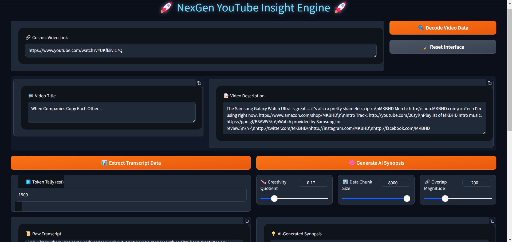
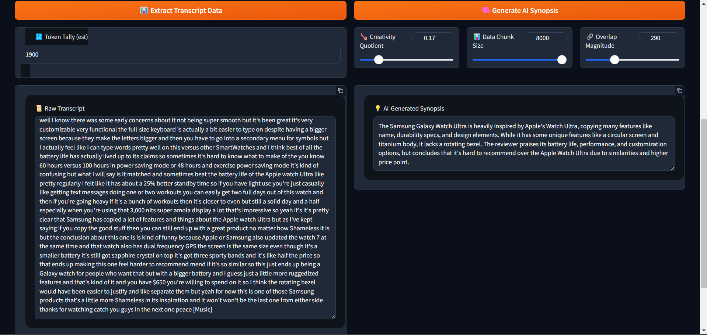

# 🚀 NexGen YouTube Insight Engine 🚀

Welcome to the LLAMA3.1_SUMMARIZER_PRO repository! This project leverages the power of AI to provide deep insights into YouTube videos, offering transcription, summarization, and more.

## 🌟 Features

- 🔗 Extract video information from YouTube URLs
- 📝 Retrieve video descriptions
- 📊 Generate transcripts with token count estimation
- 🧠 AI-powered video summarization using LLAMA 3.1
- 🌡️ Adjustable creativity settings for summarization
- 📊 Customizable chunk sizes for processing
- 🔗 Overlap control for improved context




## 🛠️ Installation

1. Clone the repository:
   ```
   git clone https://github.com/siddharthprakash1/LLAMA3.1_SUMMARIZER_PRO.git
   ```
2. Navigate to the project directory:
   ```
   cd LLAMA3.1_SUMMARIZER_PRO
   ```
3. Install the required dependencies:
   ```
   pip install -r requirements.txt
   ```

## 🚀 Usage

1. Ensure you have Ollama running locally with the LLAMA 3.1 model.
2. Run the Gradio app:
   ```
   python app.py
   ```
3. Open the provided URL in your web browser.
4. Enter a YouTube URL and explore the various features!

## 🧩 Components

- `pytube`: YouTube video data extraction
- `langchain`: Document processing and summarization
- `gradio`: User interface creation
- `tiktoken`: Token counting for GPT models
- `Ollama`: Local AI model integration

## 🎨 UI Features

- 🌈 Gradient background for an engaging user experience
- 💡 Hover effects for interactive elements
- 🔠 Custom styling for inputs, buttons, and text areas

## 🤝 Contributing

Contributions, issues, and feature requests are welcome! Feel free to check the [issues page](https://github.com/siddharthprakash1/LLAMA3.1_SUMMARIZER_PRO/issues).


## 🙏 Acknowledgements

- Thanks to the Meta AI team for the LLAMA 3.1 model
- Gradio for the amazing UI framework
- All the open-source libraries that made this project possible

---
